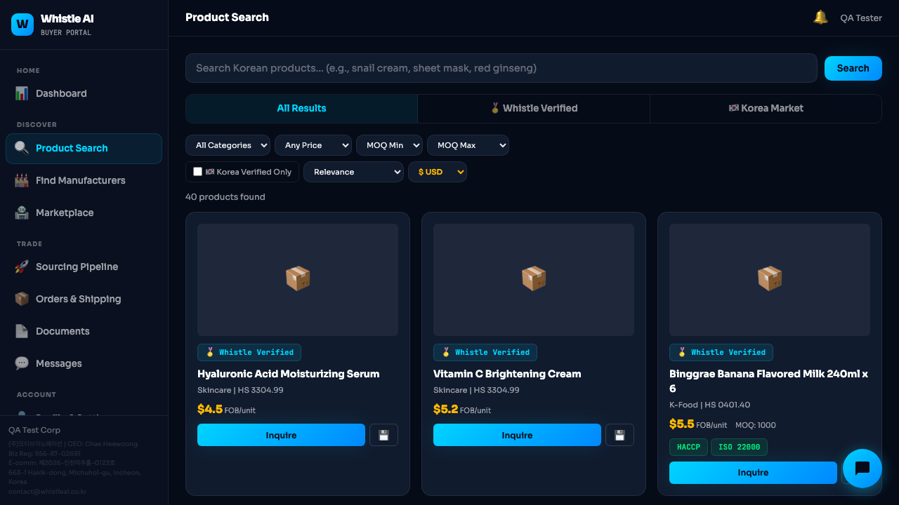
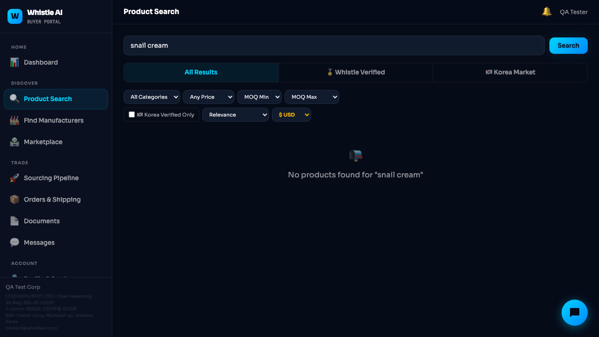
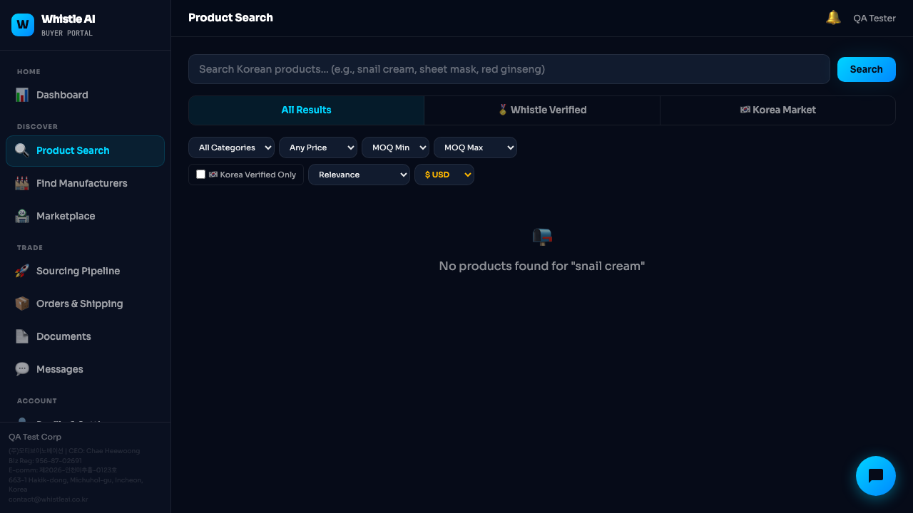
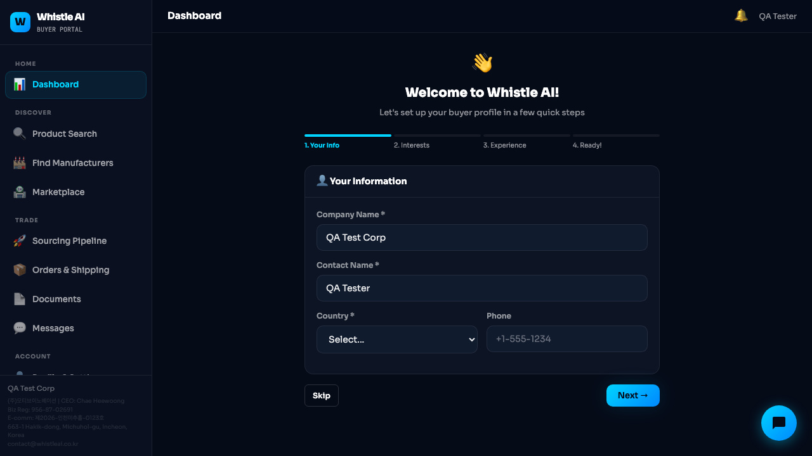
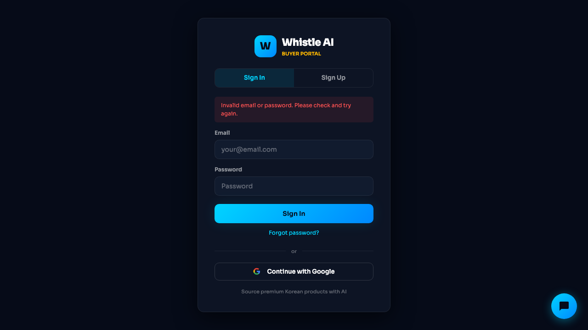
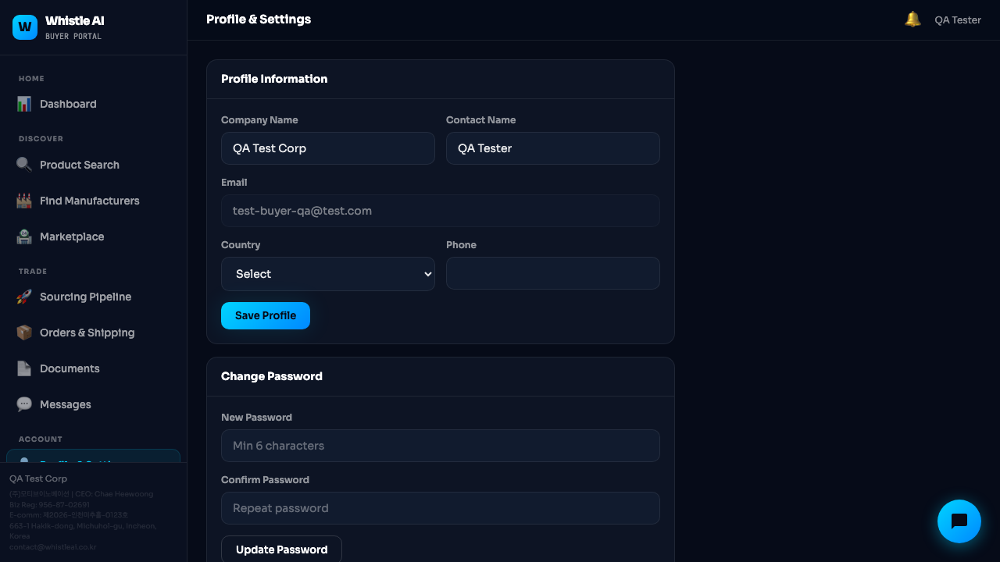
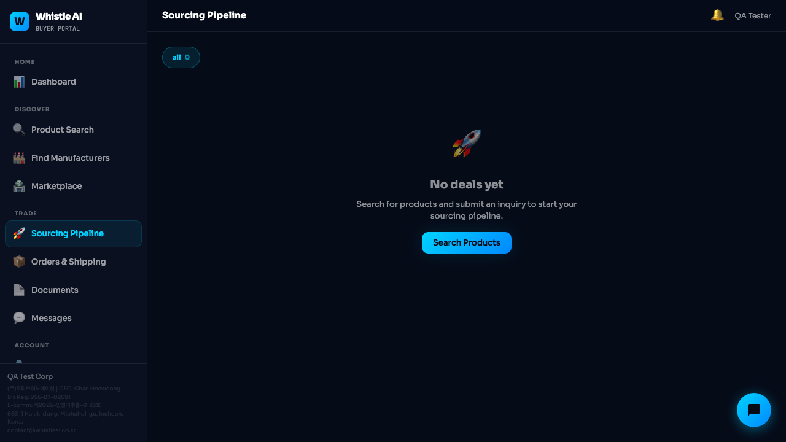
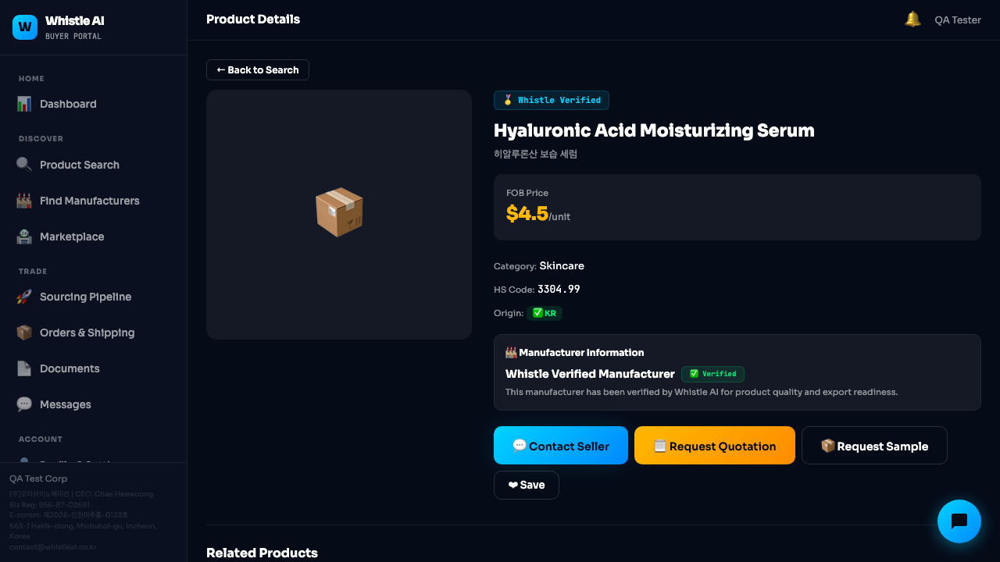

# Dogfood Report: Whistle AI Buyer Portal

| Field | Value |
|-------|-------|
| **Date** | 2026-03-12 |
| **App URL** | https://motiveinno-jpg.github.io/motive-team/buyer.html |
| **Session** | buyer-qa (agent-browser v0.17.1) |
| **Scope** | Full buyer journey: Sign Up, Search, RFQ, Chat, Inquiry, Navigation |

## Summary

| Severity | Count |
|----------|-------|
| Critical | 2 |
| High | 2 |
| Medium | 4 |
| Low | 3 |
| Info | 1 |
| **Total** | **12** |

**Overall Score**: 6.5/10 -- Solid structure and design, but several functional bugs block the core buyer journey.

## Issues

### ISSUE-001: Search cannot be cleared -- empty query leaves stale "No results" message

| Field | Value |
|-------|-------|
| **Severity** | critical |
| **Category** | functional |
| **URL** | buyer.html#search |
| **Repro Video** | N/A |

**Description**

After searching for a term that yields no results, clearing the search input and clicking Search does nothing. The `doSearch()` function at line 1288 has `if(!query)return;` which prevents any action on empty query, leaving the old "No products found" message stuck. Users cannot return to the default product listing without a page reload.

**Repro Steps**

1. Navigate to Product Search page
   

2. Search for "snail cream" -- results show "No products found"
   

3. Clear the search input and click Search again
   

4. **Observe:** Page still shows "No products found for snail cream" even though the input is empty

**Fix**: When query is empty, reset `S.searchQuery`, reload default products, and re-render.

---

### ISSUE-002: Stripe publishable key is a placeholder string

| Field | Value |
|-------|-------|
| **Severity** | critical |
| **Category** | functional |
| **URL** | buyer.html (global) |
| **Repro Video** | N/A |

**Description**

Line 231: `pk:'pk_test_REPLACE_WITH_YOUR_STRIPE_PUBLISHABLE_KEY'` -- The Stripe configuration contains a placeholder key. Any subscription checkout or payment flow will fail. The `_getStripe()` function at line 236 checks for "REPLACE" and returns null, so Stripe never initializes.

**Fix**: Replace with actual Stripe test/live publishable key before launch.

---

### ISSUE-003: Multiple console HTTP 400 errors and DNS resolution failure

| Field | Value |
|-------|-------|
| **Severity** | high |
| **Category** | console |
| **URL** | buyer.html (all pages) |
| **Repro Video** | N/A |

**Description**

Console shows 15+ `Failed to load resource: 400` errors from Supabase API calls, plus `net::ERR_NAME_NOT_RESOLVED` from the Naver search relay proxy. The relay server (`relay-url.txt` or `localhost:3456`) is not available in the production GitHub Pages environment. This means the Korea Market / Naver product search tab is completely non-functional in production.

Also: `GoTrueClient: Multiple instances detected` warning suggests Supabase client is being initialized more than once.

**Fix**: Deploy a production relay server and configure `relay-url.txt`. Add graceful error handling when relay is unavailable.

---

### ISSUE-004: Onboarding wizard Skip/Next buttons fail silently

| Field | Value |
|-------|-------|
| **Severity** | high |
| **Category** | functional |
| **URL** | buyer.html#dashboard (first-time user) |
| **Repro Video** | N/A |

**Description**

New users see a 4-step onboarding wizard. Clicking "Skip" or "Next" calls `sb.from('users').update(...)` to save progress, but if the Supabase call fails (network error, auth issue), the error is swallowed and the UI doesn't advance. The local state (`S.user.onboarding_step`) is only updated after the DB call, so it stays stuck.

**Repro Steps**

1. Log in as a new user (onboarding_completed = false)
   

2. Click "Skip" or "Next" -- nothing happens

**Fix**: Update local state optimistically before the DB call, and add `.catch()` error handling. At minimum, allow the wizard to advance locally.

---

### ISSUE-005: Login form clears both email and password after failed login

| Field | Value |
|-------|-------|
| **Severity** | medium |
| **Category** | ux |
| **URL** | buyer.html (login) |
| **Repro Video** | N/A |

**Description**

After a failed login attempt, the error message "Invalid email or password" appears correctly, but both the email and password fields are cleared. Users must re-type their email address.

**Repro Steps**

1. Enter email and password on login form
2. Submit -- get "Invalid email or password" error
   
3. **Observe:** Both fields are empty

**Fix**: Preserve the email value during re-render. Only clear the password field.

---

### ISSUE-006: All product images show package emoji placeholder

| Field | Value |
|-------|-------|
| **Severity** | medium |
| **Category** | content |
| **URL** | buyer.html#search, buyer.html#product-detail |
| **Repro Video** | N/A |

**Description**

All 40 products display a generic package emoji (box icon) instead of actual product images. This makes the platform look like a demo/mockup rather than a real marketplace.

**Fix**: Seed product data with actual image URLs in the `products` table `image_url` column.

---

### ISSUE-007: Product Detail shows generic "Whistle Verified Manufacturer" for all products

| Field | Value |
|-------|-------|
| **Severity** | medium |
| **Category** | content |
| **URL** | buyer.html#product-detail |
| **Repro Video** | N/A |

**Description**

The Manufacturer Information section on every product detail page shows "Whistle Verified Manufacturer" as the company name, instead of the actual manufacturer's business name. Buyers cannot identify who makes the product.

**Fix**: Join the `users` table on `seller_id` to populate the actual manufacturer company name.

---

### ISSUE-008: Profile page Country dropdown doesn't reflect stored user value

| Field | Value |
|-------|-------|
| **Severity** | medium |
| **Category** | functional |
| **URL** | buyer.html#profile |
| **Repro Video** | N/A |

**Description**

Even when the user state has `country: "United States"`, the Profile page's Country dropdown shows "Select" instead of the stored value.

**Fix**: Set the `<select>` element's value from `S.user.country` during profile page render.

---

### ISSUE-009: "Forgot password?" link uses href="#"

| Field | Value |
|-------|-------|
| **Severity** | low |
| **Category** | ux |
| **URL** | buyer.html (login) |
| **Repro Video** | N/A |

**Description**

The "Forgot password?" link uses `href="#"` which can cause a page jump to top. The onclick handler correctly switches to reset mode, but `href="#"` is not ideal.

**Fix**: Use `href="javascript:void(0)"` or convert to a `<button>` element.

---

### ISSUE-010: Sourcing Pipeline filter tab shows raw "all 0" styling

| Field | Value |
|-------|-------|
| **Severity** | low |
| **Category** | visual |
| **URL** | buyer.html#deals |
| **Repro Video** | N/A |

**Description**

The filter tab on Sourcing Pipeline shows "all  0" with lowercase "all" and a count, while the Marketplace page uses "All (0)" / "Open (0)" / "Closed (0)" format. This is inconsistent.

**Fix**: Standardize to "All (0)" format matching Marketplace page.

---

### ISSUE-011: Free tier search limit of 1 search/month is extremely restrictive

| Field | Value |
|-------|-------|
| **Severity** | low |
| **Category** | ux |
| **URL** | buyer.html#search |
| **Repro Video** | N/A |

**Description**

`searchCreditsLimit: 1` (line 247) means free users can only perform ONE search per month. This will cause immediate user churn as buyers cannot meaningfully explore the product catalog.

**Suggestion**: Increase to 5-10 searches for free tier to allow product discovery before upgrade prompting.

---

### ISSUE-012: Related Products section on Product Detail is empty

| Field | Value |
|-------|-------|
| **Severity** | info |
| **Category** | content |
| **URL** | buyer.html#product-detail |
| **Repro Video** | N/A |

**Description**

The "Related Products" heading is visible at the bottom of Product Detail pages, but no related products are ever shown below it.

**Fix**: Implement related products logic (same category, similar price range, or same manufacturer).

---

## Pages Status Summary

| Page | Status | Notes |
|------|--------|-------|
| Login | OK | Error messages work; form clears issue (#5) |
| Sign Up | OK | Country uses 2-letter codes; Terms/Privacy links valid |
| Dashboard | OK | Welcome message, getting started cards, stats |
| Onboarding | BROKEN | Buttons fail silently (#4) |
| Product Search | PARTIAL | Products show; search can't reset (#1); placeholder images (#6) |
| Find Manufacturers | OK | 9 categories, Custom Sourcing form |
| Marketplace | OK | Request Board with filters, New Request modal |
| Sourcing Pipeline | OK | Empty state with CTA |
| Orders & Shipping | OK | Orders/Shipments tabs |
| Documents | OK | Clean empty state |
| Messages | OK | Split-pane layout |
| Profile & Settings | PARTIAL | Country not pre-selected (#8) |
| Product Detail | PARTIAL | Good layout; generic manufacturer (#7); empty related products (#12) |
| Inquiry Modal | OK | 3 types, auto-filled destination, complete form |
| Notifications | OK | Dropdown works |

## Positive Observations

1. **Dark theme is polished** -- Consistent colors, good contrast, professional appearance
2. **Sidebar navigation well-organized** -- HOME/DISCOVER/TRADE/ACCOUNT grouping is logical
3. **Inquiry modal UX is excellent** -- 3 inquiry types with clear descriptions, auto-filled country
4. **Find Manufacturers page** -- 9 category cards with descriptions is strong discovery feature
5. **Empty states well-designed** -- Each page has appropriate empty state with CTA buttons
6. **Product cards have good info density** -- Price, category, HS code, certifications visible
7. **Korean subtitle on product detail** -- Bilingual product names add credibility

## Priority Fix Order

1. Stripe key placeholder (#2) -- Blocks all payments
2. Search reset bug (#1) -- Core feature broken
3. Onboarding wizard (#4) -- First-time user experience broken
4. Console errors / relay server (#3) -- Naver search broken in production
5. Product images (#6) -- Visual credibility
6. Manufacturer name (#7) -- Trust/information gap
7. Profile country dropdown (#8) -- Data consistency
8. Login form clearing (#5) -- Minor UX friction
